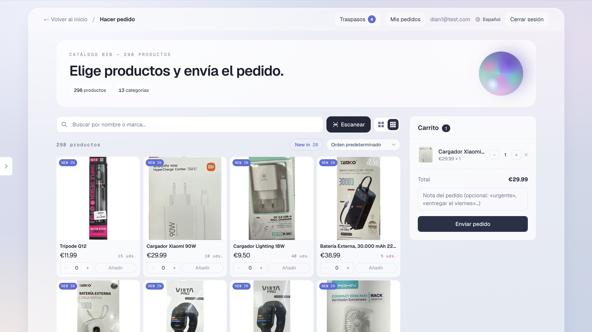
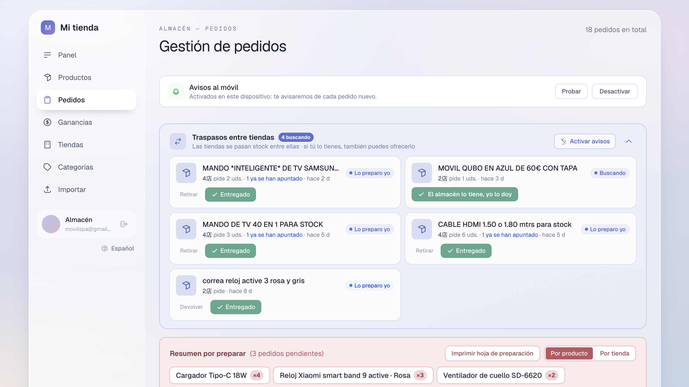

# Sistema B2B de pedidos y control de inventario multi-tienda

Plataforma interna de pedidos, control de stock y traslados entre tiendas para una **cadena de 7 tiendas con almacén central**. En producción desde julio de 2026, con ~260 productos catalogados y uso diario por parte de las tiendas.

**Stack:** Next.js · TypeScript · Supabase (PostgreSQL) · Vercel

> Proyecto desarrollado de forma individual: análisis del problema, diseño del modelo de datos, desarrollo, despliegue e implantación con usuarios reales.

<!-- Sube tus capturas al repositorio y descomenta estas líneas -->
<!--

-->

---

## 1. El problema

La cadena operaba con WhatsApp y llamadas telefónicas. Con una tienda funciona; con siete, deja de funcionar. Los fallos concretos detectados al analizar la operativa:

**Inventario invisible → capital inmovilizado.**
Las tiendas no tenían forma de saber qué había realmente en el almacén central. Cuando un producto se agotaba en la tienda, el personal asumía que tampoco quedaba en almacén y dejaba de pedirlo. Resultado: mercancía comprada que se quedaba parada indefinidamente. Dinero invertido que no rotaba.

**Reposición basada en suposiciones.**
La reposición la decidía la dirección estimando qué necesitaba cada tienda. El personal de tienda —que es quien ve la demanda real— no tenía canal para pedir lo que de verdad se estaba vendiendo.

**Consultas de precio repetidas.**
La mercancía nueva llega sin etiquetar. Cada producto generaba la misma pregunta por WhatsApp, tienda por tienda, cada vez.

**Peticiones que se pierden.**
Los traslados entre tiendas (una necesita un artículo que otra sí tiene) se pedían en un grupo de WhatsApp donde el mensaje quedaba enterrado bajo consultas de precio y conversación diaria. Pedidos olvidados, sin trazabilidad ni forma de saber quién debía atender qué.

**Preparación de pedidos fragmentada.**
Los pedidos llegaban a lo largo del día y sin agrupar: un artículo por la mañana, otro por la tarde. La persona de almacén tenía que volver a entrar a preparar pedidos continuamente, e identificar cada artículo a partir de fotos sueltas enviadas por chat. Con siete tiendas, el coste de coordinación se multiplicaba.

**Sin datos de rotación.**
No existía registro de qué se vendía bien en cada tienda, así que las decisiones de compra se tomaban a ciegas.

---

## 2. La solución

### Catálogo con precios visibles por tienda
Cada tienda tiene su propia cuenta y accede al catálogo completo organizado por categorías, con el precio de venta de cada artículo. Elimina por completo las consultas de precio: la información está donde se necesita, en el momento en que se necesita.

### Pedidos al almacén central
Cada tienda compone su pedido sobre el catálogo real, viendo lo que existe. La reposición pasa de estimarse desde dirección a solicitarse por quien conoce la demanda.

### Exportación de pedidos a PDF, agrupada
Los pedidos se exportan agrupados **por tienda** o **por tipo de producto**, según convenga a la preparación. Un pedido consolidado sustituye al goteo de peticiones a lo largo del día: quien prepara el pedido lo hace de una vez, con una lista clara, en lugar de reaccionar a mensajes sueltos.

### Traslados entre tiendas con trazabilidad
Las peticiones de artículos entre tiendas dejan de vivir en un chat. Cada solicitud queda registrada, con estado y con historial: no se pierde ninguna y puede consultarse qué se pidió, a quién y cuándo. Una misma petición puede lanzarse a varias tiendas a la vez.

### Sección "New In" como herramienta comercial
Espacio destacado donde la dirección selecciona qué productos mostrar en primer plano. Cumple dos funciones: dar a conocer las novedades, y **dar salida de forma dirigida a existencias paradas en almacén**. Es la respuesta directa al problema de capital inmovilizado: en lugar de esperar a que las tiendas pidan un artículo que han olvidado que existe, se les pone delante.

### Control de stock y rotación
El sistema mantiene el stock por producto y registra el consumo de cada tienda, lo que permite ver qué rota en cada punto de venta y ajustar las compras con datos en lugar de por intuición.

### Alta de productos por tres vías
- **Importación masiva desde Excel**, para cargas grandes
- **Alta manual**, para artículos sueltos
- **Reconocimiento de imagen**, para digitalizar producto a partir de fotografías

---

## 3. Arquitectura

| Capa | Tecnología |
|---|---|
| Frontend | Next.js (App Router), TypeScript |
| Base de datos | PostgreSQL en Supabase |
| Autenticación | Supabase Auth, una cuenta por tienda |
| Lógica en base de datos | PL/pgSQL |
| Almacenamiento de imágenes | Supabase Storage |
| Despliegue | Vercel (despliegue continuo desde `main`) |
| Idiomas de la interfaz | Español y chino |

---

## 4. Estado actual

- **En producción desde julio de 2026**
- **7 tiendas** operando con el sistema
- **~260 productos** catalogados
- **Más de 80 despliegues** a producción
- Ciclos de pedido y traslados entre tiendas en uso regular

Retorno de los usuarios: los pedidos se componen de forma más directa y con menos consultas previas, y el proceso de reposición se ha simplificado respecto a la operativa anterior por WhatsApp.

---

## 5. Trabajo en curso

- Refuerzo de las políticas de acceso a datos a nivel de base de datos (Row Level Security), para garantizar el aislamiento estricto entre tiendas
- Persistencia del precio en el momento del pedido, de modo que los pedidos históricos conserven el importe con el que se emitieron aunque el precio de catálogo cambie después
- Control de concurrencia en las actualizaciones de stock mediante transacciones, para pedidos simultáneos sobre el mismo artículo
- Informes de rotación por tienda y por categoría

---

## 6. Notas

Repositorio publicado con fines de portfolio. No contiene credenciales ni datos reales de clientes.
